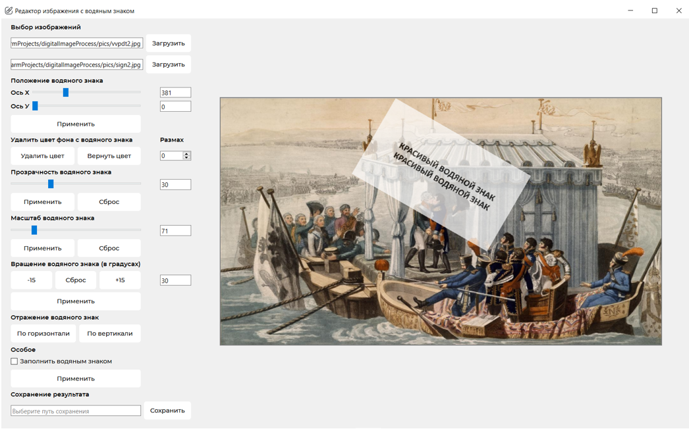
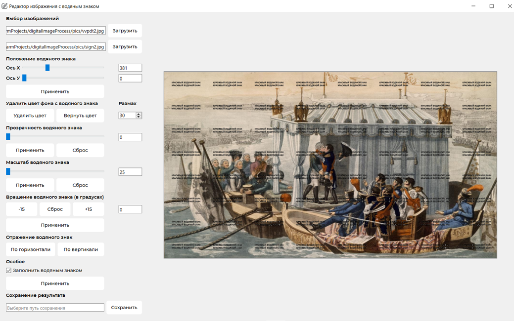

# Приложение для добавления водяного знака на изображение

## Информация

Данный проект был разработан в рамках курсовой работы по дисциплине 
"Цифровая обработка изображений". По заданию работы требовалось изучить
и реализовать некоторые функции обработки изображений, чтобы реализовать
функционал наложения водяного знака на изображения. Эти функции,
конечно, работают медленнее своих библиотечных аналогов, но задание
есть задание.

Функции реализованы в модуле ```utils```, 
базовый класс окна приложения - в модуле ```mainwindow```,
логика - в ```main```. Главный файл немного большеват, но для данного
простого проекта заниматься рефакторингом и архитектурой нецелесообразно.

В проекте также оставлен ```mainwindow.ui```, это файл для графического
редактора.

## Демонстрация
Водяной знак можно разместить на любой части основного изображения. 
Водяной знак также можно вращать, изменять размер и прозрачность, 
заполнить водяным знаком всё изображение, отражать по горизонтали и вертикали,
удалять фоновый цвет с заданным размахом.




## Установка и запуск

1. Клонируйте репозиторий:
```bash
    git clone https://github.com/bulatziyatdinov/watermark_editor
```

2. Перейдите в папку проекта:
```bash
    cd watermark_editor
```

3. Создайте виртуальную среду:
```bash
    python -m venv venv
```

4. Активируйте виртуальную среду:
```bash
    ./venv/Scripts/activate
```

5. Установите зависимости:
```bash
    pip install -r requirements.txt
```

6. Запустите приложение:
```bash
    python main.py
```
